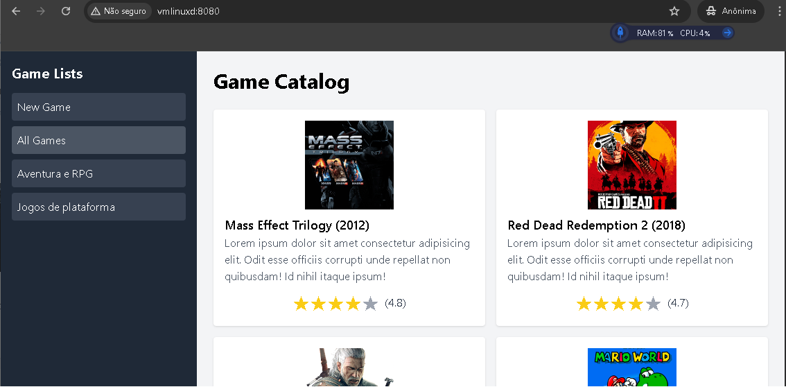

# Projeto Intensivão Java Spring - Maio/25

Este projeto foi desenvolvido durante o Intensivão Java Spring, edição de maio de 2025, ministrado por **Nélio Alves** do **DevSuperior**.


Este projeto representa um passo importante na minha jornada para a carreira backend Java, uma área com grande demanda e excelentes oportunidades no mercado de desenvolvimento.

Obrigado a todos!

## Visão Geral





O `dslist` é uma aplicação backend construída com Java e o framework Spring Boot. O objetivo principal deste projeto é fornecer funcionalidades para gerenciar listas de jogos, permitindo a criação de listas personalizadas e a organização dos jogos dentro dessas listas.

A aplicação oferece as seguintes funcionalidades:

* Listar todos os jogos.
* Buscar detalhes de um jogo específico pelo seu ID.
* Listar todas as listas de jogos.
* Listar os jogos pertencentes a uma lista específica.
* Permitir a movimentação de jogos entre diferentes posições dentro de uma mesma lista.

## Tecnologias Utilizadas

* **Java:** Linguagem de programação principal.
* **Spring Boot:** Framework Java para desenvolvimento rápido de aplicações web e microsserviços.
* **Spring Web:** Módulo do Spring para construir aplicações web.
* **Spring Data JPA:** Módulo do Spring para simplificar o acesso e a manipulação de dados com o JPA (Java Persistence API).
* **Hibernate:** Implementação do JPA utilizada pelo Spring Data JPA.
* **H2 Database (em memória):** Banco de dados relacional em memória utilizado para desenvolvimento e testes.
* **Lombok:** Biblioteca Java para reduzir a quantidade de código boilerplate.
* **Maven:** Ferramenta de gerenciamento de dependências e build.

## Estrutura do Projeto

A estrutura do projeto segue as convenções do Spring Boot, organizada em pacotes para separar as responsabilidades:

* `com.devsuperior.dslist`: Pacote principal da aplicação.
* `com.devsuperior.dslist.config`: Contém classes de configuração, como a configuração de CORS (`WebConfig`).
* `com.devsuperior.dslist.controllers`: Contém os controladores REST que expõem os endpoints da API (`GameController`, `GameListController`).
* `com.devsuperior.dslist.dto`: Contém os Data Transfer Objects (DTOs) utilizados para transportar dados entre a API e a camada de serviço (`GameDTO`, `GameListDTO`, `GameMinDTO`, `ReplacementDTO`).
* `com.devsuperior.dslist.entities`: Contém as classes de entidade que representam as tabelas do banco de dados (`Belonging`, `BelongingPK`, `Game`, `GameList`).
* `com.devsuperior.dslist.projections`: Contém interfaces que definem projeções para consultas JPQL (`GameMinProjection`).
* `com.devsuperior.dslist.repositories`: Contém as interfaces de repositório que estendem `JpaRepository` para acesso aos dados (`GameListRepository`, `GameRepository`).
* `com.devsuperior.dslist.services`: Contém as classes de serviço que implementam a lógica de negócios da aplicação (`GameListService`, `GameService`).

## Como Executar a Aplicação

1.  **Pré-requisitos:**
    * Java Development Kit (JDK) 17 ou superior instalado.
    * Maven instalado.

2.  **Clonar o Repositório (se aplicável):**
    ```bash
    git clone https://github.com/fabiuniz/dslist-rest.git
    cd dslist
    ```

3.  **Executar a Aplicação:**
    Você pode executar a aplicação de duas maneiras:

    * **Usando o Maven:**
        ```bash
        mvn spring-boot:run
        ```

    * **Executando a classe principal:**
        Localize a classe `DslistApplication.java` dentro do pacote `com.devsuperior.dslist` e execute-a como uma aplicação Java em sua IDE (IntelliJ IDEA, Eclipse, etc.).

4.  **Acessar a API:**
    Após a aplicação ser iniciada, você poderá acessar os endpoints da API através de ferramentas como o Postman, Insomnia ou um navegador web. Alguns endpoints de exemplo:

    * `GET /games`: Lista todos os jogos em formato `GameMinDTO`.
    * `GET /games/{id}`: Busca os detalhes do jogo com o ID especificado em formato `GameDTO`.
    * `GET /lists`: Lista todas as listas de jogos em formato `GameListDTO`.
    * `GET /lists/{listId}/games`: Lista os jogos da lista com o ID especificado em formato `GameMinDTO`.
    * `POST /lists/{listId}/replacement`: Permite mover um jogo de uma posição para outra dentro da lista especificada (requer um corpo JSON com `sourceIndex` e `destinationIndex`).

## Agradecimentos

Gostaria de expressar minha profunda gratidão:

* A **Nélio Alves** e toda a equipe da **DevSuperior** por criarem um treinamento tão completo e prático como o Intensivão Java Spring. A clareza das explicações e a abordagem focada em projetos são inestimáveis para o aprendizado.


Este projeto é um resultado direto do conhecimento e das ferramentas disponibilizadas durante o Intensivão Java Spring. Muito obrigado!